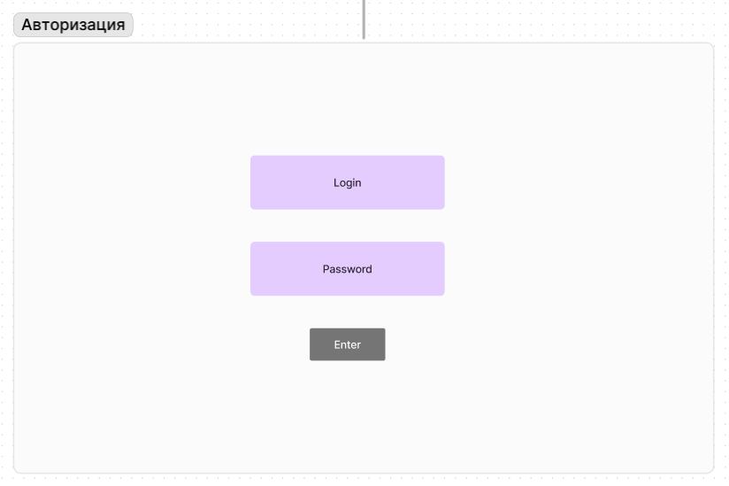
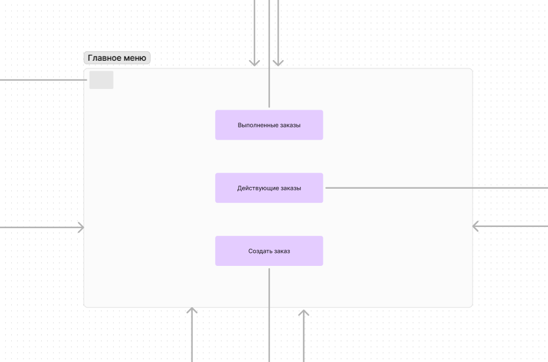
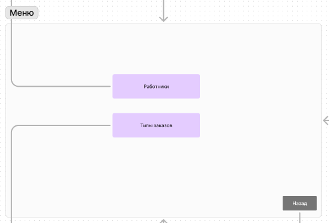
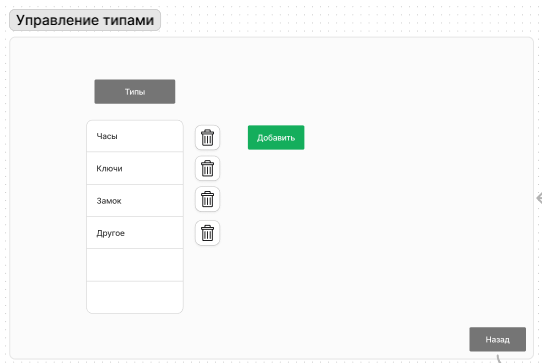
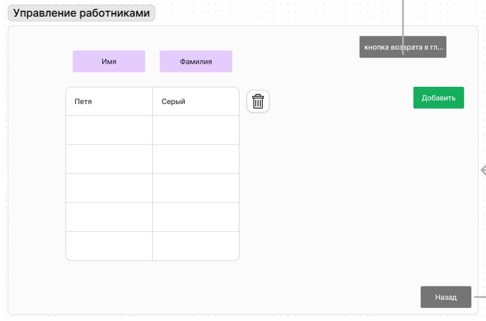
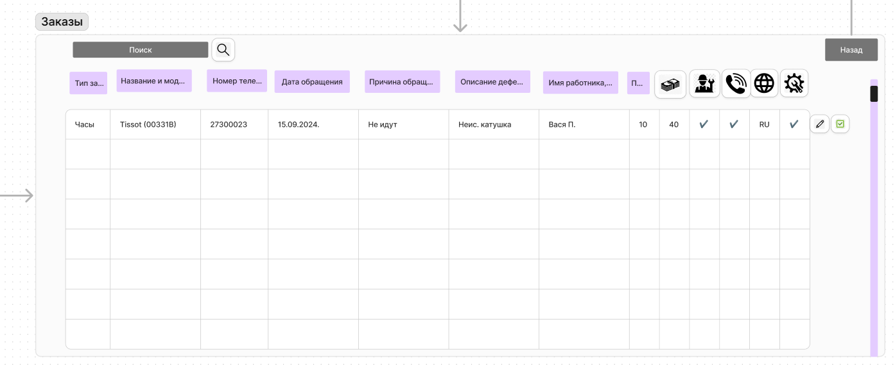
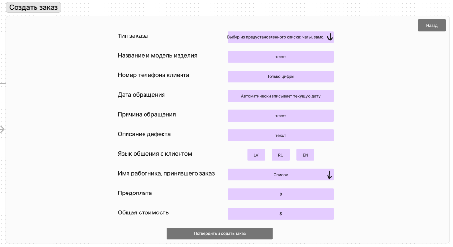

# UI/UX Maket

## 1. Авторизация
При запуске программы пользаватель попадает в окно авторизации.

Попав в окно "авторизации" можно увидеть 1 кнопку и 2 поля ввода.

Кнопка "Enter" отвечает за отсылания запроса в БД для сверки введёных данных, если всё совпадает, действующее окно скрывается и открывется новое окно, рисунок под номером 2.

## 2. Главное меню

   
В "главном меню" будут 4 кнопки
При нажатии кнопки "заказы" окно с главным меню скрывается и нам открывается новое окно, картинка под номером 6.

При нажатии кнопки "заказы" окно с главным меню скрывается и нам открывается новое окно, картинка под номером 6.

При нажатии кнопки "создать заказ" окно с главным меню скрывается и нам открывается новое окно, картинка под номером 7.

Так же присутвуствует сверху слева кнопка в виде шестерёнки, при нажатии которой скрывается окно с главным меню и переводит на страницу авторизации, картинка под номером 3.

## 3.Меню

Попав в окно  "Меню"  можно увидеть 3 кнопки.

Кнопка "Работники", при нажатии на неё пользователя перебрасывает в окно "Управдение работниками" скрыв текущее окно.

Кнопка "Типы заказов", при нажатии на неё пользователя перебрасывает в окно "Управление типами" скрыв текущее окно.

Кнопка "Назад", при нажатии на неё пользователя перебрасывает в "главное меню" скрыв текущее окно.

## 4. Управление типами

Попав в окно "Управление типами"  можно увидеть 2 кнопки и 1 таблица состоящая из 1 столбца.

Кнопка "Добавить", при нажатии на неё, программа отсыалет записанное (если поле пустое дожно выдовать ошибку) в БД.
    
Кнопка "Назад", при нажатии на неё пользователя перебрасывает в "Меню" (рисю. 3) скрыв текущее окно.

Так же при создании типа и появлении его в столбце, справа от него должна появлятся кнопка (иконка) мусорника, при нажатии на неё появляется сообщение с вопросом и двумя кнопками отввета да или нет. При потверждении действия запись удаляется.

## 5. Управление работниками

Попав в окно "Управление работниками" можно увидеть 3 кнопки и 1 таблица состоящая из 2 столбцов.

Кнопка "Добавить", при нажатии на неё, программа отсыалет записанное (если поле пустое дожно выдовать ошибку) в БД.
    
Кнопка "Назад", при нажатии на неё пользователя перебрасывает в "Меню" (рисю. 3) скрыв текущее окно.

Кнопка "возрата в главное меню" при нажатии на неё пользователя перебрасывает в "Главное меню" (рисю. 2) скрыв текущее окно.

Так же при создании типа и появлении его в столбце, справа от него должна появлятся кнопка (иконка) мусорника, при нажатии на неё появляется сообщение с вопросом и двумя кнопками отввета да или нет. При потверждении действия запись удаляется.
    

## 6. Заказы
Попав в окно "Заказ" можно увидеть 4 кнопки, 1 поле ввода и 1 таблица состоящая из 13 столбцов.

Кнопка "Поиск" рядом с полем ввода, при нажатии на неё происходит поиск записей с хожим номером телефона в БД.

Кнопка "Карандашик" справа от сторки записи, при нажатии на него можно вносить изменения в строку записи и далее нажав на зелёную галочку отсылаются изменённые данные в БД.

Кнопка "Назад", при нажатии на неё пользователя перебрасывает в "главное меню" скрыв текущее окно.

## 7. Создать заказ
Попав в окно "Создать заказ" можно увидеть 5 кнопок, 9 полей ввода.
     
Кнопка "Назад", при нажатии на неё пользователя перебрасывает в "главное меню" скрыв текущее окно.
     
Кнопка "Подтвердить и создать заказ". При нажатии на неё все введённые данные отправляются в БД, и создаётся заказ, который становится активным.

Кнопки "RU" "LV" "EN", при нажатии кнопки, нажатая кнопка становится подсвеченной, остальные остаются такими же, как и были до нажатия. Если изменить выбор, например с "RU" на "EN", то новая нажатая кнопка подсвечивается, а остальные возвращаются в исходное состояние.

