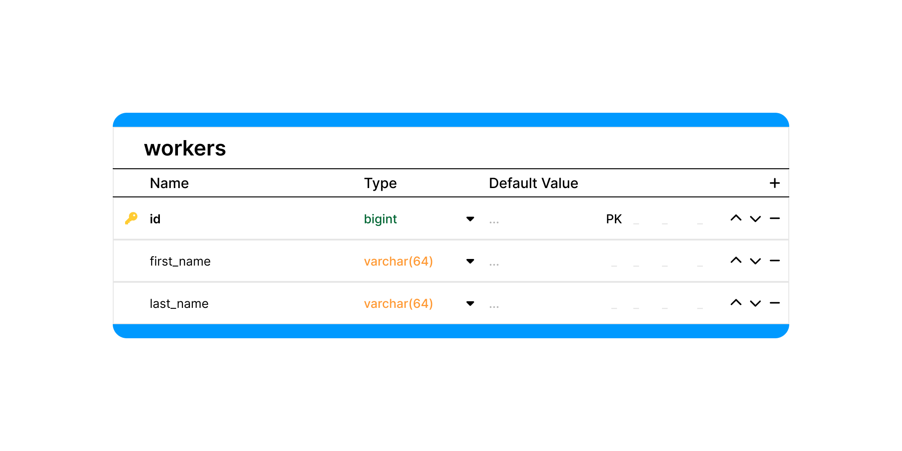
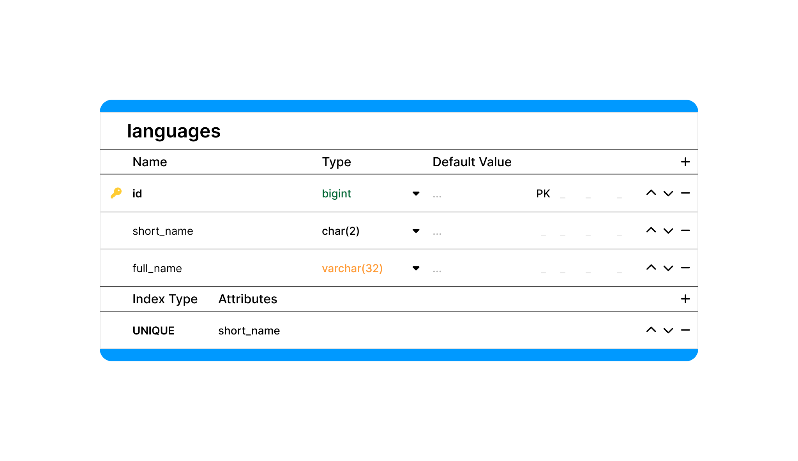

# Схема Базы Данных

Данная структура базы данных предназначена для системы управления заказами. Она охватывает различные аспекты работы с заказами, включая их создание, обработку, хранение информации о клиентах, сотрудниках и администраторах, а также статусы и типы заказов. В структуре базы данных предусмотрены ключевые сущности для эффективного управления процессами.

## Orders

Таблица содержит информацию о каждом заказе, включая детали о клиенте, статусе, типе заказа, и суммы, связанные с оплатой.

| Имя             | Тип          | NULL? | Комментарий                                                    |
|-----------------|--------------|-------|----------------------------------------------------------------|
| id              | bigint       | -     | Идентификатор заказа.                                          |
| order_status_id | bigint       | -     | Внешний ключ. Статус заказа.                                   |
| order_type_id   | bigint       | -     | Внешний ключ. Тип заказа из существующего списка типов заказа. |
| worker_id       | bigint       | -     | Внешний ключ. Работник, принявший заказ.                       |
| customer_id     | bigint       | -     | Внешний ключ. Информация о клиенте.                            |
| item_name       | varchar(255) | -     | Название и модель изделия.                                     |
| reason          | text         | +     | Причина обращения (описание запроса клиента).                  |
| defect          | text         | +     | Описание дефектов, если таковые имеются.                       |
| total_price     | varchar(64)  | +     | Итоговая сумма за выполнение заказа.                           |
| prepayment      | varchar(64)  | +     | Сумма, внесенная клиентом в момент создания заказа.            |
| created_at      | timestamp    | -     | Дата обращения.                                                |

## Order_statuses

Таблица хранит статусы заказов, такие как готовность к выдаче, уведомление клиента и информацию о том, передан ли заказ на аутсорсинг.

| Имя                  | Тип       | NULL? | Комментарий                                              |
|----------------------|-----------|-------|----------------------------------------------------------|
| id                   | bigint    | -     | Идентификатор статуса заказа.                            |
| ready_at             | timestamp | +     | Дата завершения ремонта.                                 |
| returned_at          | timestamp | +     | Дата выдачи заказа клиенту.                              |
| customer_notified_at | timestamp | +     | Дата уведомления клиента о готовности заказа.            |
| is_outsourced        | bool      | -     | Флаг, указывающий на передачу заказа стороннему мастеру. |
| is_receipt_lost      | bool      | -     | Флаг, указывающий на утерю квитанции клиентом.           |

## Order_types

Таблица содержит различные типы заказов, которые можно выбирать при создании заказа.

| Имя       | Тип         | NULL? | Комментарий               |
|-----------|-------------|-------|---------------------------|
| id        | bigint      | -     | Идентификатор типа заказа |
| full_name | varchar(32) | -     | Название типа заказа      |

## Workers

Таблица содержит информацию о сотрудниках, ответственных за обработку заказов.

| Имя        | Тип         | NULL? | Комментарий             |
|------------|-------------|-------|-------------------------|
| id         | bigint      | -     | Идентификатор работника |
| first_name | varchar(64) | -     | Имя работника           |
| last_name  | varchar(64) | -     | Фамилия работника       |

## Customers

Таблица содержит информацию о клиентах, включая их контактные данные и предпочитаемый язык общения.

| Имя          | Тип         | NULL? | Комментарий                |
|--------------|-------------|-------|----------------------------|
| id           | bigint      | -     | Идентификатор клиента      |
| language_id  | bigint      | -     | Внешний ключ. Язык общения |
| phone_number | varchar(20) | -     | Номер телефона клиента     |

## Languages

Таблица содержит список языков, на которых можно общаться с клиентами.

| Имя        | Тип         | NULL? | Комментарий                                           |
|------------|-------------|-------|-------------------------------------------------------|
| id         | bigint      | -     | Идентификатор языка                                   |
| short_name | char(2)     | -     | Сокращённое название языка (lv, ru)                   |
| full_name  | varchar(32) | -     | Полное название языка (Latviešu valoda, Русский язык) |

## Admins

Таблица содержит информацию о администраторах системы, включая имя пользователя и пароль для входа.

| Имя      | Тип         | NULL? | Комментарий                  |
|----------|-------------|-------|------------------------------|
| id       | bigint      | -     | Идентификатор администратора |
| username | varchar(64) | -     | Имя пользователя             |
| password | text        | -     | Пароль                       |
