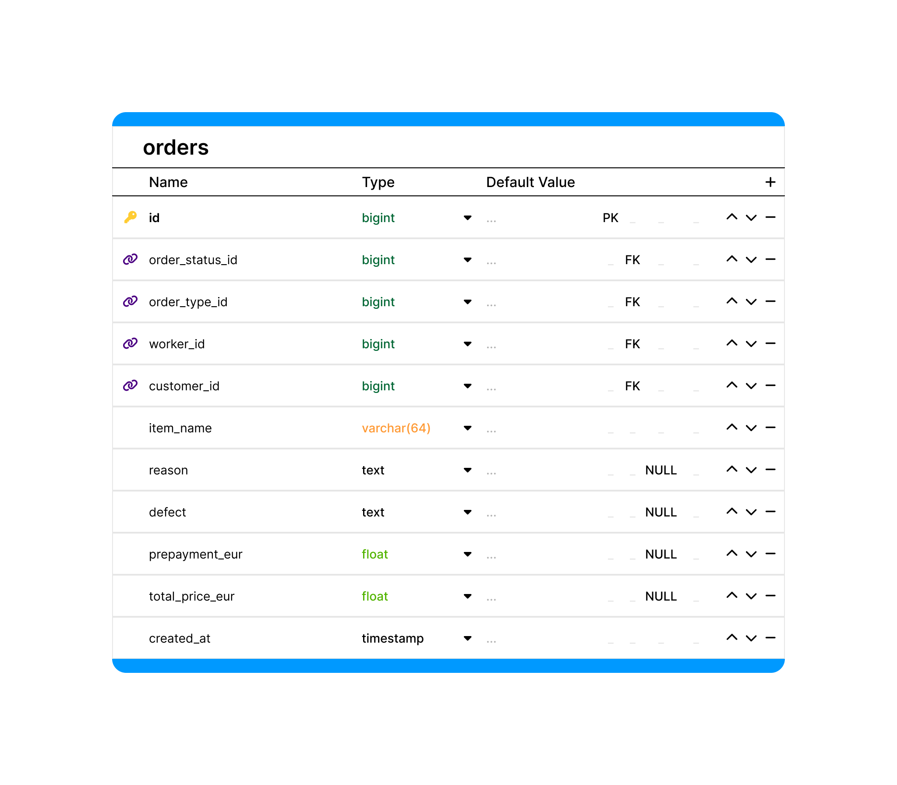
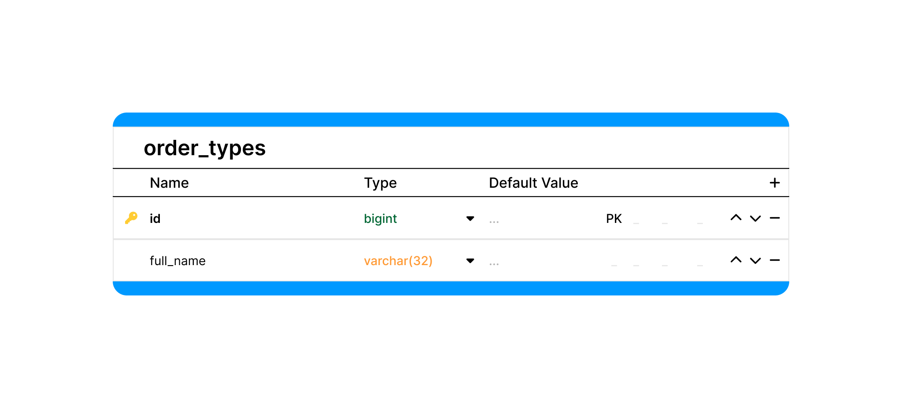
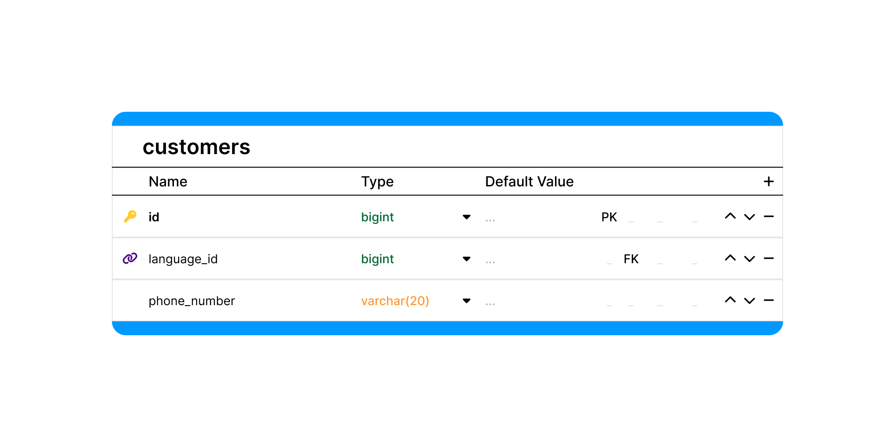

# DB structure design

## 1. Orders

Orders - таблица заказов
| Name | Type | NULL | Comment  |
| ---- | ---- |------|--------- |
| id  |bigint | |Идентификатор заказа   |
| order_status_id  |bigint|| Внешний ключ. Статус заказа  |
| order_type_id  |bigint|| Внешний ключ. Тип заказа из существующего списка типов заказа  |
| worker_id  |bigint|| Внешний ключ. Работник, принявший заказ   |
| customer_id  |bigint|| Внешний ключ. Информация о клиенте (язык общения, номер телефона)   |
| order_name | varchar(255) |  | Название и модель изделия  |
| order_date| date |  | Дата обращения |
| reason |text|NULL| Причина обращения (описание запроса клиента)  |
| defect  |text|NULL| Описание дефектов, если таковые имеются   |
| total_price  |varchar(64)|NULL| Итоговая сумма за выполнение заказа  |
| prepayment  |varchar(64)|NULL| Сумма, внесенная клиентом в момент создания заказа  |

## 2. Order_statuses
Order_statuses - таблица статусов заказов
| Name | Type | NULL | Comment  |
| ---- | ---- |------|--------- |
| id  |bigint | |Идентификатор статуса заказа   |
| ready_at | datetime | NULL |Заказ отремонтирован, готов к выдаче  |
| returned_at | datetime | NULL | Заказ отдан клиенту |
| customer_notified_at| datetime | NULL | Состояние обзвона клиента (отмечается, если клиент был оповещен о готовности заказа) |
| is_outsourced | bool |  | Ремонт отдан мастеру (отмечается, если заказ передан мастеру для выполнения и находится у него)  |
| is_receipt_lost | bool |  | Потеряна квитанция (отмечается, если клиент потерял квитанцию) |

## 3. Order_types
Order_types - таблица типов заказов
| Name | Type | NULL | Comment  |
| ---- | ---- |------|--------- |
| id  |bigint | |Идентификатор типа заказа   |
|full_name | varchar(32) |  | Название типа заказа   |

## 4. Workers
Workers - таблица работников
| Name | Type | NULL | Comment  |
| ---- | ---- |------|--------- |
| id  |bigint | |Идентификатор работника   |
| first_name |varchar(64) | |Имя работнка  |
| last_name |varchar(64)| |Фамилия работника |

## 5. Customers
Customers - таблица клиентов
| Name | Type | NULL | Comment  |
| ---- | ---- |------|--------- |
| id  |bigint | |Идентификатор клиента  |
| language_id |bigint | |Внешний ключ. Язык общения  |
 phone_number|varchar(20)| | Номер телефона клиента |

## 6. Languages
Languages - таблица языков общения с клиентом
| Name | Type | NULL | Comment  |
| ---- | ---- |------|--------- |
| id  |bigint | |Идентификатор языка |
| short_name|char(2)| |Cокращенное название языка|
 full_name|varchar(32)| | Название языка |

 

 ## 7. Admins
 Admins - таблица админов
 | Name | Type | NULL | Comment  |
| ---- | ---- |------|--------- |
| id  |bigint | |Идентификатор админа|
| username|varchar(64)| |Имя пользователя|
 password|text| | Пароль|

  