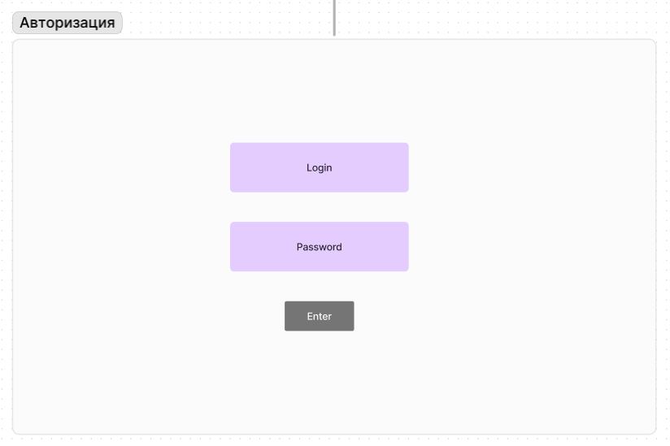
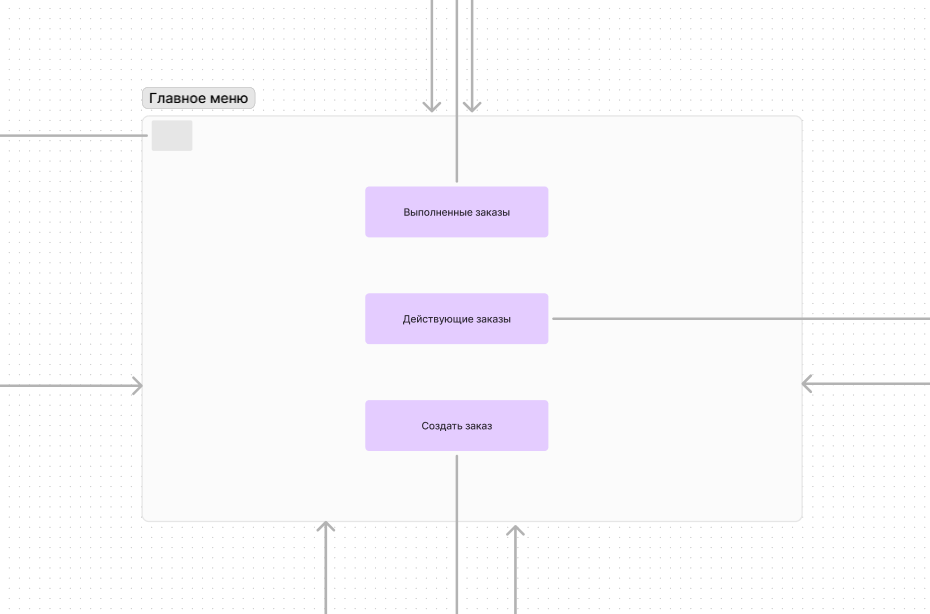
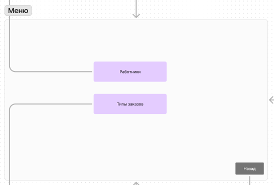
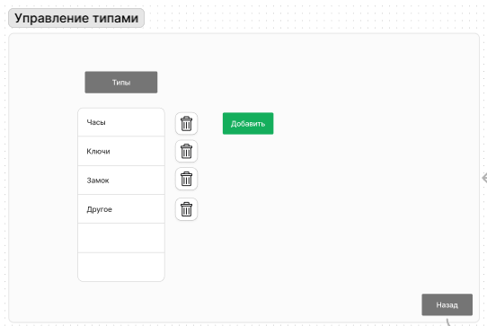
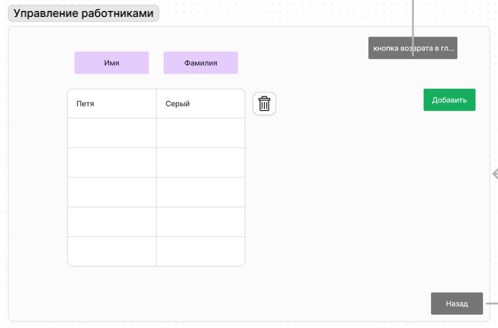
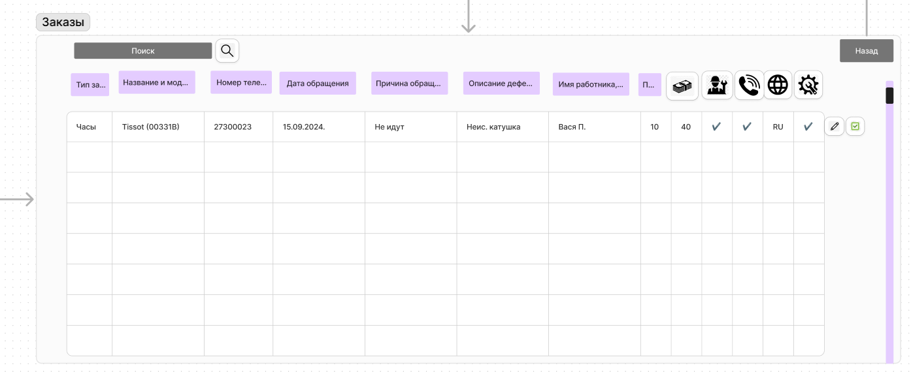
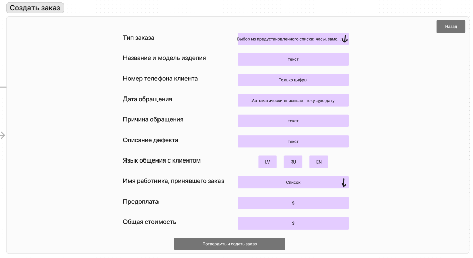

# UI/UX Sketch

Данный документ описывает структуру пользовательского интерфейса и взаимодействие с основными экранами приложения. Каждый раздел содержит информацию о доступных кнопках и функциях, а также последовательности действий пользователя при работе с интерфейсом. 

## Авторизация

При запуске программы пользователь попадает в окно авторизации, где доступны одна кнопка и два поля ввода.

* Кнопка **Enter** отправляет запрос в базу данных для проверки введённых данных. Если данные верны, текущее окно скрывается, и открывается новое окно.

## Главное меню

В главном меню доступны четыре кнопки:

* Кнопка **Заказы** — при нажатии скрывается главное меню и открывается новое окно.
* Кнопка **Создать заказ** — при нажатии также скрывается главное меню и открывается окно создания заказа.
* Кнопка с иконкой шестерёнки — расположена в левом верхнем углу. При нажатии открывается страница авторизации.

## Меню

В меню доступны три кнопки:

* Кнопка **Работники** — при нажатии открывается окно управления работниками, текущее окно скрывается.
* Кнопка **Типы заказов** — при нажатии открывается окно управления типами заказов, текущее окно скрывается.
* Кнопка **Назад** — возвращает пользователя в главное меню, скрывая текущее окно.

## Управление типами

В окне **Управление типами** есть две кнопки и одна таблица с одним столбцом:

* Кнопка **Добавить** — отправляет введённые данные в базу данных. Если поле пустое, появляется сообщение об ошибке.
* Кнопка **Назад** — возвращает пользователя в меню, скрывая текущее окно.

После добавления нового типа в таблицу, рядом с ним появляется иконка мусорной корзины. При нажатии на неё появляется сообщение с вопросом и кнопками **Да** и **Нет**. При подтверждении записи удаляются.

## Управление работниками

В окне "Управление работниками" представлены три кнопки и таблица с двумя столбцами:

* Кнопка **Добавить** — отправляет введённые данные в базу данных. Если поле пустое, программа выведет ошибку.
* Кнопка **Назад** — возвращает пользователя в меню, скрывая текущее окно.
* Кнопка **Возврат в главное меню** — возвращает пользователя в главное меню, скрывая текущее окно.

Как и в управлении типами, после добавления записи появляется иконка мусорной корзины для удаления с подтверждением.
    

## Заказы

В окне заказов доступны четыре кнопки, одно поле ввода и таблица с 13 столбцами:

* Кнопка **Поиск** — расположена рядом с полем ввода и инициирует поиск записей по номеру телефона.
* Кнопка с иконкой карандаша — позволяет редактировать запись. После изменений нажатие на зелёную галочку отправляет данные в базу.
* Кнопка **Назад** — возвращает пользователя в главное меню.

## Создать заказ

В окне создания заказа доступны пять кнопок и девять полей ввода:

* Кнопка **Назад** — возвращает пользователя в главное меню.
* Кнопка **Подтвердить и создать заказ** — отправляет введённые данные в базу данных и создаёт активный заказ.
* Кнопки **RU**, **LV**, **EN** — при нажатии на одну из кнопок выбранный язык подсвечивается, а остальные остаются неактивными. Изменение выбора подсвечивает новую выбранную кнопку.

